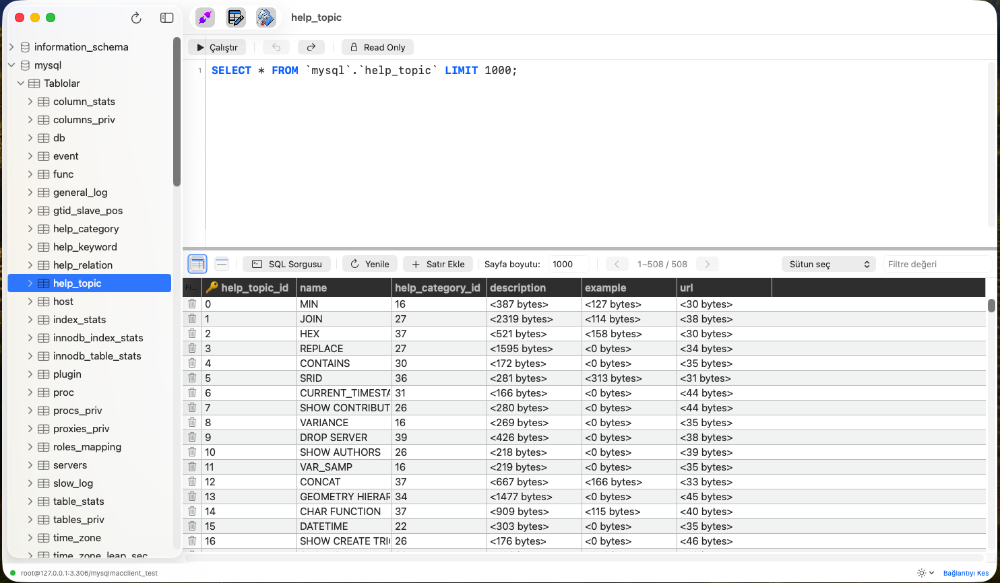
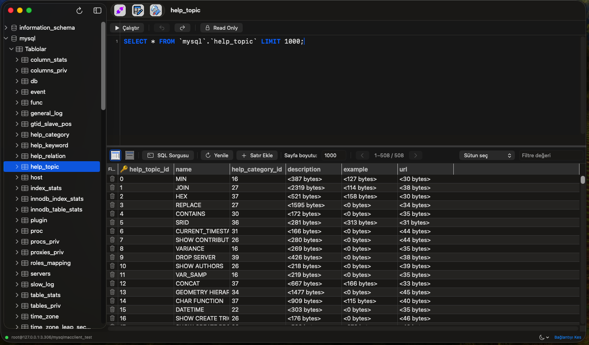
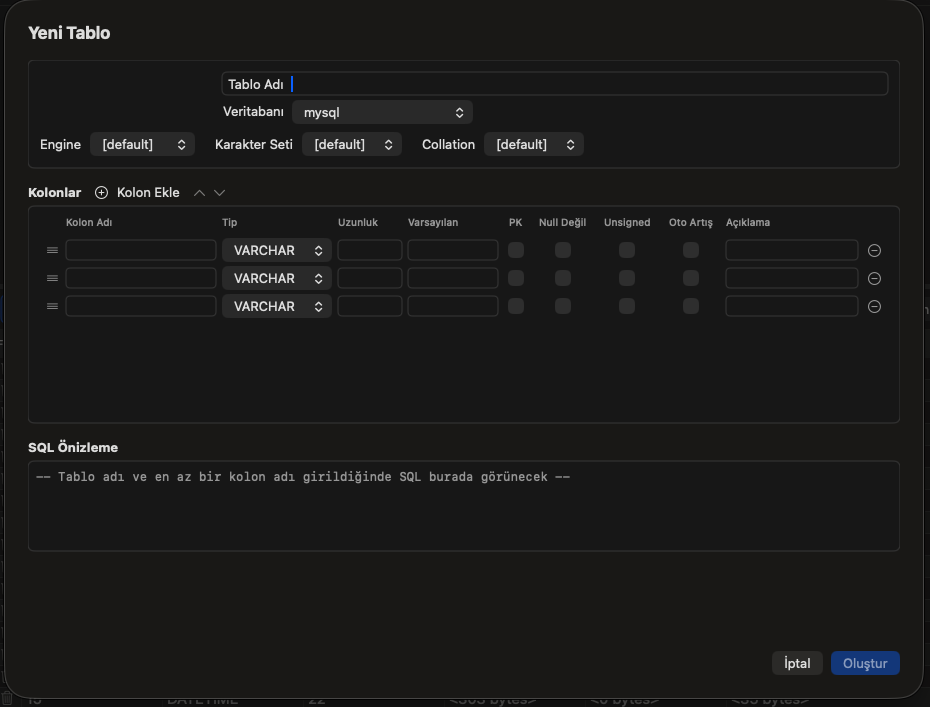
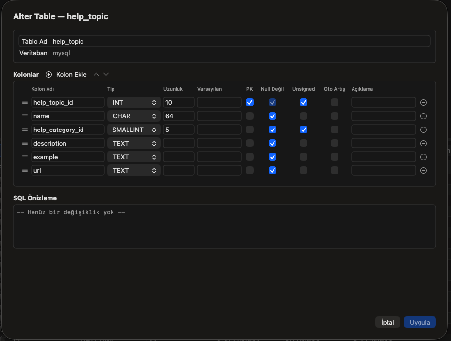

# MySQLMacClient

A native macOS MySQL management tool built with **Swift 6 / SwiftUI**, inspired by SQLyog. Designed as a personal desktop client for managing MySQL databases — local (XAMPP) or remote (cPanel shared hosting, etc.).

> **Status:** Active development · MVP complete · Personal-use tool

---

## Screenshots

<p align="center">
  
  
</p>
<p align="center">
  
  
</p>

---

## Features

### Connection Management
- Multiple connection profiles with named presets
- Passwords stored securely in **macOS Keychain** (never on disk)
- Connection metadata persisted in `~/Library/Application Support/MySQLMacClient/connections.json`

### Schema Browser
- Multi-database tree: databases → tables (sidebar with `NavigationSplitView`)
- Table info panel with column details, types, and key indicators

### Data Grid
- **NSTableView-backed spreadsheet grid** — performant with large result sets
- Inline cell editing with dirty-tracking (only changed columns generate `UPDATE`)
- Row insert / delete with PK-aware SQL generation
- Column sorting and basic filtering (parameterized queries — no SQL injection)
- Pagination via `LIMIT / OFFSET` with configurable page size

### SQL Query Panel
- Multi-line SQL editor with **syntax highlighting** (keywords, strings, numbers, comments)
- Tab / Shift-Tab indentation, Undo/Redo support
- Line numbers, current-line highlighting
- Query results displayed in a dedicated grid
- Right-click SQL templates for quick `SELECT`, `INSERT`, `UPDATE`, etc.

### Table Management
- **Create Table** form with column editor (name, type, length, nullable, default, auto-increment)
- **Alter Table** — add / modify / reorder / drop columns
- Column drag-and-drop reordering

### Settings
- Light / Dark / System appearance picker
- Sidebar width, grid row height, alternating row colors
- SQL editor font size configuration
- Grid ↔ Text view toggle for query results

---

## Tech Stack

| Layer | Technology |
|-------|-----------|
| Language | Swift 6.2 (strict concurrency) |
| UI | SwiftUI + AppKit (`NSTableView` for grids, `NSTextView` for SQL editor) |
| MySQL | [vapor/mysql-nio](https://github.com/vapor/mysql-nio) v1.9.1 — pure Swift, async/await, no C bindings |
| Secrets | macOS Keychain via Security framework |
| Build | Swift Package Manager (no `.xcodeproj`) |
| Target | macOS 15+ |

---

## Architecture

```
Sources/MySQLMacClient/
├── App/                    # @main entry, AppDelegate, AppState
├── Models/                 # ConnectionProfile, TableInfo, ColumnInfo, RowValue, TableRow
├── Services/               # MySQLService, SchemaIntrospectionService, KeychainService
├── Persistence/            # ConnectionStore (JSON file)
├── ViewModels/             # ConnectionFormVM, TableListVM, TableDataVM, QueryPanelVM, ...
├── Views/                  # SwiftUI views + AppKit bridging (SpreadsheetGridView, SQLTextView)
└── Resources/              # Bundled images / screenshots
```

**MVVM** with `@Observable` / `@StateObject` view models. Services own the MySQL connection lifecycle (`EventLoopGroup` + `MySQLConnection`). Primary key detection via `SHOW KEYS` enables safe cell-level editing; tables without a PK fall back to read-only mode with a visible banner.

---

## Getting Started

### Prerequisites
- **macOS 15+** and **Xcode 16+** (or Swift 6.0+ toolchain)
- A running MySQL server (local XAMPP, Docker, remote, etc.)

### Build & Run

```bash
# Clone
git clone https://github.com/stokay/MySQLMacClient.git
cd MySQLMacClient

# Build and run
swift run

# — or open in Xcode for full IDE experience —
open Package.swift
```

### First Connection
1. Launch the app → the connection form appears
2. Fill in host, port (default 3306), username, password, and a connection name
3. Click **Connect** — the sidebar populates with databases and tables
4. Select a table to browse/edit data in the grid

> **Note:** If your MySQL 8+ server uses `caching_sha2_password`, you may need to switch to `mysql_native_password` for MySQLNIO compatibility:
> ```sql
> ALTER USER 'your_user'@'%' IDENTIFIED WITH mysql_native_password BY 'your_password';
> ```

---

## Roadmap

- [x] Connection form with Keychain-based password storage
- [x] Multi-database schema tree
- [x] NSTableView data grid with inline editing
- [x] PK-aware INSERT / UPDATE / DELETE generation
- [x] SQL query editor with syntax highlighting
- [x] Create Table / Alter Table forms
- [x] Settings panel (appearance, grid, editor)
- [ ] Query history persistence
- [ ] Full schema tree (views, procedures, functions, triggers)
- [ ] Export / Import (CSV, SQL dump)
- [ ] Connection pooling
- [ ] Packaged `.app` bundle with icon & Info.plist

---

## License

Personal project — no license specified.
